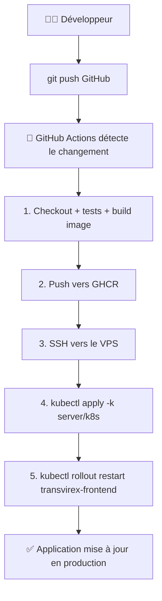
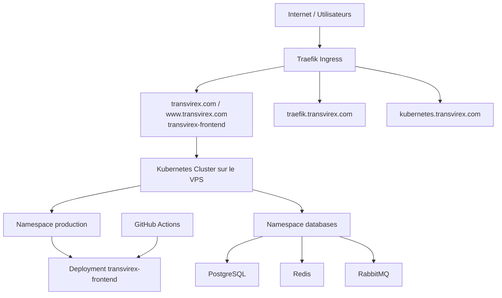

# 🚀 Transvirex ERP - Guide de déploiement complet

## 📚 Par où commencer ?

Bienvenue ! Ce projet contient les fichiers nécessaires pour déployer Transvirex sur un VPS en utilisant **Kubernetes**, **Traefik** et **GitHub Actions**.

### 🎯 **Ordre de lecture recommandé** (ne saute pas les étapes!)

| #   | Document                                                          | Durée      | Contenu                                               |
| --- | ----------------------------------------------------------------- | ---------- | ----------------------------------------------------- |
| 1️⃣  | **Ce guide**                                                      | 5 min      | Vue d'ensemble et guide de navigation                 |
| 2️⃣  | [Installation Guide](./06-INSTALLATION-GUIDE.md)                  | 30 min     | Guide principal (Phase 1 + Phase 2 automatisés)       |
| 3️⃣  | [Concepts Kubernetes](./01-CONCEPTS-KUBERNETES.md)                | 15 min     | Comprendre Kubernetes (si nouveau)                    |
| 4️⃣  | [Concepts Traefik](./02-CONCEPTS-TRAEFIK.md)                      | 15 min     | Comprendre le routage des requêtes                    |
| 5️⃣  | [GitHub Actions](./03-CONCEPTS-GITHUB-ACTIONS.md)                 | 15 min     | Comprendre l'automatisation CI/CD du workflow         |
| 6️⃣  | [Architecture de l'application](./08-ARCHITECTURE-APPLICATION.md) | 20 min     | Comprendre les microservices et leurs rôles           |
| 7️⃣  | [GitHub Actions deploy](./06-INSTALLATION-GUIDE.md#phase-2)       | 15 min     | Comprendre le workflow `.github/workflows/deploy.yml` |
| 8️⃣  | [Configuration Reference](./05-CONFIGURATION-REFERENCE.md)        | 20 min     | Exemples de fichiers (référence)                      |
| 9️⃣  | [Deployment VPS](./07-DEPLOYMENT-VPS.md)                          | 2-3 heures | Étapes détaillées VPS (hands-on)                      |

**Total**: ~2-3 heures pour la compréhension + 2-3 heures pour le déploiement

---

## 🎬 En 2 minutes : Le flux complet



**Le tout en 5-10 minutes, automatiquement!**

---

## 📊 Architecture globale



---

## ✅ Prérequis

### Côté développeur (ta machine)

- [ ] Git installé
- [ ] Accès au repository GitHub
- [ ] Permissions pour ajouter des secrets GitHub

### Côté serveur (VPS)

- [ ] Ubuntu 20.04+ (ou autre Linux)
- [ ] 4 GB RAM minimum (8+ recommandé)
- [ ] Docker, Kubernetes, Helm installés
- [ ] SSH access
- [ ] Adresse IP fixe
- [ ] Certificat SSL (acheté, ou Let's Encrypt)

> **Pas de VPS encore?** Tu peux utiliser:
>
> - [Linode](https://www.linode.com/) (recommandé, bien documenté)
> - [DigitalOcean](https://www.digitalocean.com/) (facile pour débutants)
> - [OVH](https://www.ovhcloud.com/) (français, bon support)
> - [Ionos](https://www.ionos.com/) (où tu as acheté ton domaine)

---

## 🚀 Déploiement rapide (résumé)

### Phase 1️⃣: Initialiser le VPS (2-3 heures, une seule fois)

Sur ton VPS:

```bash
# 1. Installer Docker, K8s, Helm
# 2. Initialiser cluster Kubernetes
# 3. Créer namespaces
# 4. Déployer Traefik via Helm
# 5. Déployer l'application via GitHub Actions
# 6. Cloner le repository GitHub

# Tous les détails → 07-DEPLOYMENT-VPS.md
```

→ [Instructions complètes](./07-DEPLOYMENT-VPS.md)

### Phase 2️⃣: Configurer les déploiements GitHub Actions (15 min)

```bash
# 1. Générer un Personal Access Token GitHub
# 2. Ajouter les secrets GitHub Actions (VPS_HOST, VPS_SSH_KEY)
# 3. Pousser le workflow `.github/workflows/deploy.yml`
# 4. Laisser GitHub Actions construire et déployer

# Tous les détails → 06-INSTALLATION-GUIDE.md § Phase 2
```

→ [Instructions complètes](./06-INSTALLATION-GUIDE.md#phase-2--déploiements-automatisés-github-actions)

### Phase 3️⃣: Déploiements automatisés (après)

```bash
# C'est fini! Dès maintenant, à chaque push GitHub:
git push origin main

# → GitHub Actions exécute le workflow
# → Build, transfert et déploiement
# → App mise à jour en production
```

---

## 📂 Structure du repo

```
CESI_A4_DevWeb/
│
├── 📖 Documentation (docs/)
│   ├── 00-GETTING-STARTED.md        ← Tu es ici
│   ├── 01-CONCEPTS-KUBERNETES.md
│   ├── 02-CONCEPTS-TRAEFIK.md
│   ├── 03-CONCEPTS-GITHUB-ACTIONS.md  ← Workflow CI/CD GitHub Actions
│   ├── 04-GITHUB-SECRETS.md
│   ├── 05-CONFIGURATION-REFERENCE.md
│   ├── 06-INSTALLATION-GUIDE.md
│   ├── 07-DEPLOYMENT-VPS.md
│   └── 08-ARCHITECTURE-APPLICATION.md
│
├── 🔧 Configuration Kubernetes + Infrastructure
│   └── server/
│       ├── traefik/
│       │   ├── values.yaml               ← Config Traefik
│       │   └── README.md
│       └── k8s/
│           ├── namespace.yaml            ← production + databases
│           ├── production/               ← frontend + ingress + secrets
│           └── databases/                ← PostgreSQL, Redis, RabbitMQ
│
├── 🔄 CI/CD Pipelines
│   └── .github/
│       └── workflows/
│           ├── deploy-traefik.yml        ← Pipeline 1
│           └── deploy.yml                ← Workflow de build/deploy
│
└── 📦 Code applicatif
    └── src/
        ├── frontend/                     ← Nuxt 3
        └── backend/                      ← API / logique serveur
```

---

## 🎯 Cas d'usage typiques

### 1️⃣ **Je veux juste comprendre l'architecture** (sans déployer)

Lis dans cet ordre:

1. [Ce guide](#getting-started) (2 min)
2. [Concepts Kubernetes](./01-CONCEPTS-KUBERNETES.md) (15 min)
3. [Concepts Traefik](./02-CONCEPTS-TRAEFIK.md) (15 min)
4. [GitHub Actions](./03-CONCEPTS-GITHUB-ACTIONS.md) (15 min)
5. [Architecture de l'application](./08-ARCHITECTURE-APPLICATION.md) (20 min)

→ **Total: ~45 minutes pour une compréhension complète**

### 2️⃣ **Je veux déployer sur mon VPS** (setup complet)

Lis dans cet ordre:

1. [Installation Guide](./06-INSTALLATION-GUIDE.md) (30 min, introduction)
2. [Concepts (1-3 au-dessus)](#cas-dusage-typiques) (45 min, comprendre)
3. [GitHub Actions Setup](./06-INSTALLATION-GUIDE.md#phase-2--déploiements-automatisés-github-actions) (15 min, configurer)
4. [Configuration Reference](./05-CONFIGURATION-REFERENCE.md) (20 min, comprendre les fichiers)
5. [Deployment VPS](./07-DEPLOYMENT-VPS.md) (2-3 heures, hands-on VPS)

→ **Total: ~4-5 heures pour un déploiement complet**

### 3️⃣ **Je veux juste déployer rapidement** (copier-coller)

1. [Deployment VPS](./07-DEPLOYMENT-VPS.md) section "Quick Start" (si existe)
2. Change les URLs/IPs/passwords
3. Exécute les commandes

⚠️ Mais tu ne comprendras pas ce que tu fais → Pas recommandé

### 4️⃣ **J'ai un problème, comment déboguer?**

1. Voir quelle section du déploiement a échoué
2. Aller dans [Deployment VPS](./07-DEPLOYMENT-VPS.md) → Section "Dépannage"
3. Exécuter les commandes de diagnostic
4. Lire les logs Kubernetes:

```bash
# Voir les erreurs
kubectl describe pod pod-name -n namespace
kubectl logs pod-name -n namespace -f  # Live logs

# Voir l'état général
kubectl get all -n production
kubectl get events -n production
```

---

## 🛠️ Commandes essentielles

Tu verras ces commandes partout dans les docs:

```bash
# Kubernetes
kubectl get pods -n production           # Voir les pods
kubectl logs pod-name -n namespace       # Voir les logs
kubectl exec -it pod-name -n ns /bin/sh # Entrer dans un pod

# Helm
helm install NAME CHART -f values.yaml   # Installer
helm upgrade NAME CHART -f values.yaml   # Mettre à jour
helm list -n namespace                   # Lister

# Redirection ports (pour accès local)
kubectl port-forward -n ns svc/NAME 8080:8080  # Local → VPS

# Git + GitHub
git push origin main                     # Trigger les workflows
git clone ...                            # Cloner le repo
```

---

## 🆘 Support & Dépannage

### Docs officielles

- [Kubernetes Docs](https://kubernetes.io/docs/)
- [Helm Docs](https://helm.sh/docs/)
- [Traefik Docs](https://doc.traefik.io)
- [GitHub Actions Docs](https://docs.github.com/en/actions)

### Dans ce projet

1. [Deployment VPS → Dépannage](./07-DEPLOYMENT-VPS.md#dépannage)
2. [Installation Guide → Dépannage](./06-INSTALLATION-GUIDE.md#dépannage)
3. [Concept docs → Checklist](.)

### Erreurs courantes

| Erreur                       | Cause                   | Solution                                                      |
| ---------------------------- | ----------------------- | ------------------------------------------------------------- |
| `kubectl: command not found` | Kubectl non installé    | Voir Deployment VPS § Installation Kubernetes                 |
| `Pods en CrashLoopBackOff`   | Erreur application      | `kubectl logs pod-name` + voir les logs                       |
| `Image pull error`           | Secret docker manquant  | Vérifier `kubectl get secrets -n ns`                          |
| `KUBECONFIG_BASE64 invalid`  | Secret GitHub mal formé | Re-encoder: `cat ~/.kube/config \| base64 -w 0`               |
| `Certificat SSL error`       | Cert corrompu/expiré    | Vérifier le certificat avec `openssl x509 -in cert.crt -text` |

---

## 📝 Checklist avant déploiement

- [ ] J'ai lu [Installation Guide](./06-INSTALLATION-GUIDE.md)
- [ ] J'ai un VPS avec Docker + Kubernetes + Helm
- [ ] J'ai un domaine et certificat SSL
- [ ] J'ai ajouté les 4 secrets dans GitHub
- [ ] J'ai compris les concepts (K8s, Traefik, GitHub Actions)
- [ ] J'ai préparer le VPS selon [Deployment VPS](./07-DEPLOYMENT-VPS.md)
- [ ] J'ai déployé Traefik et configuré GitHub Actions
- [ ] J'ai testé un premier déploiement

---

## 🎓 Apprentissage progressif

Si tu es complètement nouveau à Kubernetes:

```
Jour 1: Concepts théoriques (2-3 heures)
├─ Lire tous les "Concepts" docs
├─ Comprendre les diagrammes
└─ Faire des questions (ChatGPT, Google)

Jour 2: Installation + Déploiement (3-4 heures)
├─ Préparer VPS
├─ Installer Docker, K8s, Helm
├─ Déployer Traefik
└─ Déployer l'application via GitHub Actions

Jour 3: Test + Validation (1-2 heures)
├─ Tester un déploiement simple
├─ Vérifier les logs
└─ Déboguer les problèmes

Jour 4+: Production + Maintenance
├─ Déployer le frontend et le backend
├─ Configurer le monitoring
├─ Mettre en place les backups
└─ Documenter le setup
```

---

## 💡 Conseils pratiques

### 🔐 Sécurité

1. **Jamais en clair dans le code**: Les secrets vont dans GitHub Secrets
2. **Certificats à jour**: Renouvelle les certificats SSL avant expiration
3. **Accès VPS limité**: Utilise SSH keys, pas de root password
4. **Backups réguliers**: Kubernetes peut tout perdre → backup les données

### ⚡ Performance

1. **Ressources**: Adapter CPU/Memory selon ton VPS (voir `values.yaml`)
2. **Replicas**: Laisser au moins 2 replicas par service (haute disponibilité)
3. **Health checks**: Configurer les liveness/readiness probes

### 📊 Monitoring

1. **Logs**: Centraliser les logs (Elasticsearch, Loki, etc)
2. **Métriques**: Prometheus + Grafana pour visualiser
3. **Alertes**: Configurer les alertes pour les erreurs

---

## 🎉 Prochaines étapes après déploiement

Une fois Traefik + GitHub Actions en place:

1. **Déployer les applications**
    - Frontend Nuxt
    - Backend API
    - Services auxiliaires si nécessaire

2. **Configurer les bases de données**
    - PostgreSQL (données)
    - Redis (cache sessions)
    - RabbitMQ (messages asynchrones)
    - MongoDB (logs + IA)

3. **Mise en place du monitoring**
    - Prometheus (collecte métriques)
    - Grafana (visualisation)
    - Alerting

4. **Haute disponibilité**
    - Multi-node cluster
    - Backup automatisé
    - Disaster recovery

---

## 📞 Besoin d'aide?

- **Documentation**: Lis les docs (elles sont très détaillées!)
- **Google**: "Kubernetes [error]", "GitHub Actions [problem]"
- **ChatGPT**: Excellent pour les questions techniques
- **Community**: Kubernetes Slack, GitHub Community Discussions

---

## 📜 License & Attribution

Ce projet utilise:

- [Kubernetes](https://kubernetes.io/) - Open Source
- [Helm](https://helm.sh/) - Open Source
- [Traefik](https://traefik.io/) - Open Source
- [GitHub Actions](https://docs.github.com/actions) - CI/CD intégré à GitHub

---

## ✅ Prêt à commencer?

**Première étape:**

```bash
# 1. Clone le repo
git clone https://github.com/YOUR_ORG/CESI_A4_DevWeb.git
cd CESI_A4_DevWeb

# 2. Lis le guide d'installation
cat docs/06-INSTALLATION-GUIDE.md

# 3. Lis les concepts (si nouveau)
cat docs/01-CONCEPTS-KUBERNETES.md
cat docs/02-CONCEPTS-TRAEFIK.md
cat docs/03-CONCEPTS-GITHUB-ACTIONS.md

# 4. Prépare ton VPS
# (Suis docs/07-DEPLOYMENT-VPS.md)

# C'est parti! 🚀
```

**Bonne chance!** 💪

---

_Dernière mise à jour: 21 mai 2026_
