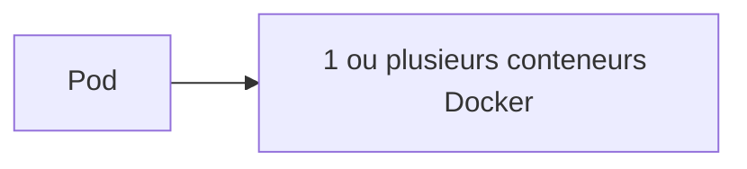
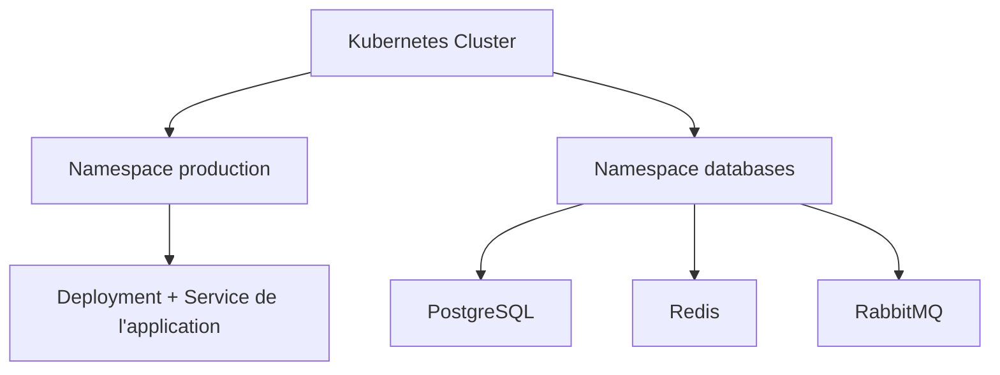
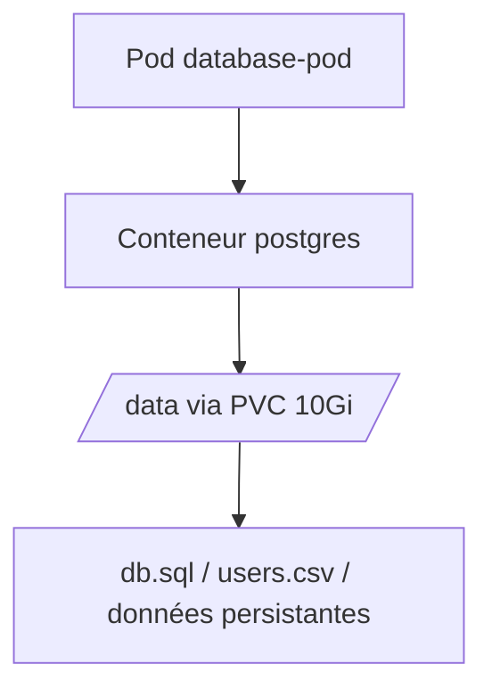
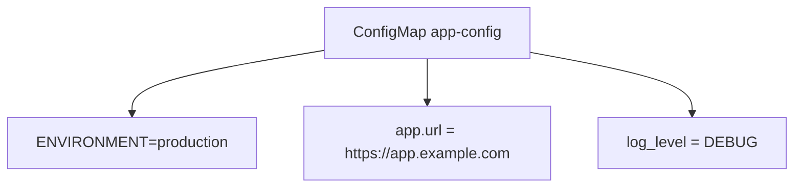
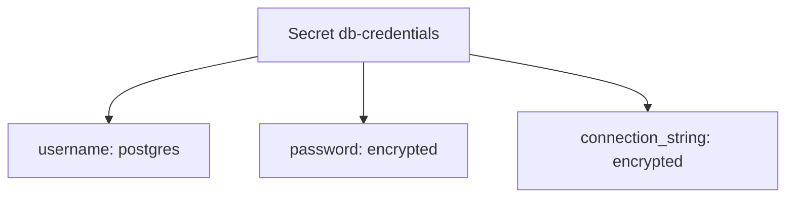
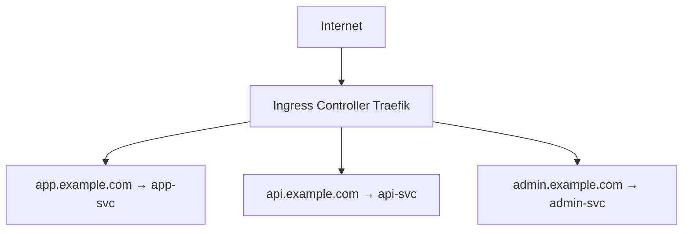
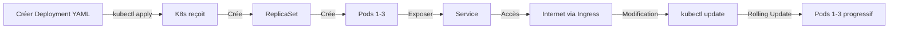

# 📘 Comprendre Kubernetes en 15 minutes

## 🎯 En une phrase

**Kubernetes (K8s)** est un **orchestrateur de conteneurs** : c'est un système automatisé qui gère le lancement, l'arrêt, la distribution et la réparation de tes applications Docker sur un serveur (ou une flotte de serveurs).

---

## 🧩 L'analogie du manager

Imagine que tu diriges une usine avec plusieurs chaînes de production :

- **Sans Kubernetes** : Tu dois dire manuellement aux ouvriers
    - "Lance cette machine"
    - "Si elle casse, relance-la"
    - "Si trop de commandes arrivent, ajoute une machine"
    - "Si une machine est à 90%, redistribue le travail"

- **Avec Kubernetes** : Tu dis juste une fois ce que tu veux
    - "Je veux 3 copies de cette machine en fonctionnement"
    - K8s gère TOUT automatiquement
    - Une tombe ? K8s la relance
    - Il y a trop de charge ? K8s ajoute des copies

---

## 🏗️ Les concepts clés de Kubernetes

### 📦 **Pod** = Unité la plus petite

C'est simplement un **conteneur Docker** (ou plusieurs dans le même environnement réseau).

```
Pod = 1 (ou plusieurs) conteneur(s) Docker
```



**Exemple :**

```yaml
Pod "my-app-pod-12345"
├── Conteneur: mon-app:v1.0
│   ├── Port 3000
│   └── 512 MB RAM
```

> **Important** : On ne lance JAMAIS un pod directement. On utilise des objets de plus haut niveau (Deployment, StatefulSet, etc.)

---

### 🎮 **Deployment** = Chef d'orchestre

C'est l'objet qui dit à K8s : "Je veux **3 copies** de mon app".

**Quand tu crées un Deployment :**

````
```mermaid
flowchart TB
    Deploy[Deployment my-app] --> P1[Pod 1 Running]
    Deploy --> P2[Pod 2 Running]
    Deploy --> P3[Pod 3 Running]
    P1 -. crash .-> P4[Pod 4 Starting]
````

- K8s lance 3 pods de ton app
- Si 1 pod crash → K8s relance un nouveau
- Si tu dis "passe à 5 copies" → K8s en lance 2 de plus
- Les mises à jour sont progressives (rolling update)

```
Deployment "my-app"
├── Pod 1 (replica 1) - Running
├── Pod 2 (replica 2) - Running
└── Pod 3 (replica 3) - Running

Si Pod 1 crash:
Deployment "my-app"
├── Pod 1 - Terminating
├── Pod 2 - Running
├── Pod 3 - Running
└── Pod 4 - Starting (nouveau)
```

---

### 🌐 **Service** = Point d'accès stable

Les pods sont **éphémères** (ils naissent et meurent).

Les Services fournissent une adresse **stable** (IP + Port) qui redirige vers les pods.

| Type          | Accès             | Utilisation                      |
| ------------- | ----------------- | -------------------------------- |
| **ClusterIP** | Interne seulement | Communication entre services K8s |

````
```mermaid
flowchart TB
    Internet[Internet] --> Service[Service LoadBalancer my-app-svc\n203.0.113.1:80]
    Service --> Pod1[Pod 1\nPort 3000]
    Service --> Pod2[Pod 2\nPort 3000]
    Service --> Pod3[Pod 3\nPort 3000]
````

| **NodePort** | Via IP du serveur + port | Accès local (pour tests) |
| **LoadBalancer** | Internet | Accès externe à l'app |

```
Internet
    ↓
Service LoadBalancer "my-app-svc" (IP: 203.0.113.1:80)
    ↓
    ├→ Pod 1 (Port 3000)
    ├→ Pod 2 (Port 3000)
    └→ Pod 3 (Port 3000)
```

---

### 📁 **Namespace** = Compartiment d'isolation

Les namespaces partitionnent les ressources dans le cluster.

C'est comme des réseaux isolés: ce qui se passe dans `production` ne voit pas `databases`.

**Avantages :**

- Isolation des ressources
- Politiques de sécurité différentes par namespace
- Organisations claires



---

### 💾 **Persistent Volume (PV) & Persistent Volume Claim (PVC)** = Stockage

Les pods meurent = les données disparaissent!

**PV & PVC** créent du stockage persistant:

- PV = Espace disque physique réservé
- PVC = "Je demande 2 GB de stockage"

K8s attache le PVC au pod, et si le pod meurt, les données restent.



---

### 🎟️ **ConfigMap & Secret** = Configuration et données sensibles

**ConfigMap** = Configuration non-sensible



**Secret** = Données sensibles (chiffrées)



---

### 📊 **Ingress** = Routeur (point d'entrée principal)

L'Ingress route les requêtes HTTP/HTTPS vers les bons services.

C'est le point d'entrée unique pour ton application.



> **Dans notre projet :** Traefik est notre Ingress Controller.

---

## 🚀 Cycle de vie typique



---

## 📝 Fichiers YAML typiques

### Exemple : Deployment simple

```yaml
apiVersion: apps/v1
kind: Deployment
metadata:
    name: my-app
spec:
    replicas: 3 # 3 copies
    selector:
        matchLabels:
            app: my-app
    template:
        metadata:
            labels:
                app: my-app
        spec:
            containers:
                - name: app
                  image: ghcr.io/myorg/my-app:v1.0
                  ports:
                      - containerPort: 3000
                  resources:
                      requests:
                          memory: '256Mi'
                          cpu: '100m'
                      limits:
                          memory: '512Mi'
                          cpu: '500m'
```

### Exemple : Service + Ingress

```yaml
---
apiVersion: v1
kind: Service
metadata:
    name: my-app-svc
spec:
    selector:
        app: my-app
    ports:
        - port: 80
          targetPort: 3000
    type: ClusterIP
---
apiVersion: networking.k8s.io/v1
kind: Ingress
metadata:
    name: my-app-ingress
spec:
    ingressClassName: traefik
    rules:
        - host: app.example.com
          http:
              paths:
                  - path: /
                    pathType: Prefix
                    backend:
                        service:
                            name: my-app-svc
                            port:
                                number: 80
```

---

## 🛠️ Commandes essentielles

```bash
# Vérifier l'état du cluster
kubectl cluster-info
kubectl get nodes

# Lister les ressources
kubectl get namespaces
kubectl get deployments -n production
kubectl get pods -n production
kubectl get services -n production

# Appliquer une configuration
kubectl apply -f deployment.yaml

# Voir les logs
kubectl logs -n production -l app=my-app

# Accéder directement à un pod
kubectl exec -it pod-name-xyz -- /bin/bash

# Rediriger un port local
kubectl port-forward -n production svc/my-app-svc 8000:80
```

---

## ✅ À retenir

| Concept        | Rôle                                 |
| -------------- | ------------------------------------ |
| **Pod**        | Conteneur Docker (unité minimale)    |
| **Deployment** | Manager des pods (replicas, updates) |
| **Service**    | Point d'accès stable (IP + port)     |
| **Namespace**  | Compartiments isolés                 |
| **PV/PVC**     | Stockage persistant                  |
| **Secret**     | Données sensibles chiffrées          |
| **Ingress**    | Routeur HTTP/HTTPS                   |

---

## 📚 Pour aller plus loin

- Docs officielles : https://kubernetes.io/docs/
- Tutoriel interactif : https://kubernetes.io/docs/tutorials/kubernetes-basics/
