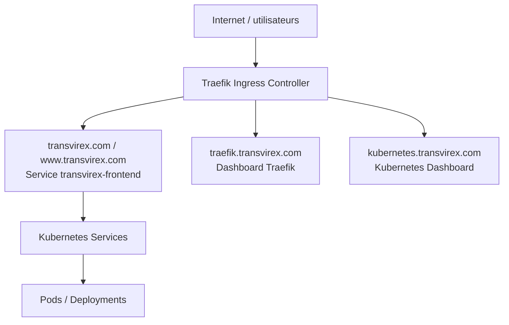
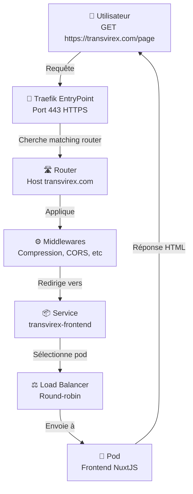

# 🚦 Comprendre Traefik en 15 minutes

## 🎯 En une phrase

**Traefik** est un **routeur + load balancer** automatisé qui :

- Reçoit les requêtes HTTP/HTTPS des utilisateurs
- Les redirige vers le bon microservice en fonction du domaine/URL
- Gère automatiquement les certificats SSL
- Équilibre la charge entre plusieurs copies d'un service

---

## 📍 Où situer Traefik dans l'architecture



**Traefik est le point d'entrée unique** de ta plateforme.

---

## 🏗️ Les concepts clés de Traefik

### 🎟️ **EntryPoint** = Port d'écoute

Les EntryPoints sont les ports sur lesquels Traefik écoute les requêtes.

```yaml
entryPoints:
    web:
        address: ':80'
    websecure:
        address: ':443'
    traefik:
        address: ':9000'
    k8s-dashboard:
        address: ':8443'
```

| EntryPoint      | Port | Protocole | Utilisation                        |
| --------------- | ---- | --------- | ---------------------------------- |
| `web`           | 80   | HTTP      | Requêtes non-chiffrées (optionnel) |
| `websecure`     | 443  | HTTPS     | Requêtes chiffrées                 |
| `traefik`       | 9000 | HTTP      | Entrée du dashboard Traefik        |
| `k8s-dashboard` | 8443 | HTTPS     | Entrée du Kubernetes Dashboard     |

---

### 🛣️ **Router** = Règles de routage

Les Routers définissent les règles pour diriger les requêtes vers un service.

**Exemple :** "Si la requête arrive sur transvirex.com → dirige vers le service `transvirex-frontend`"

```yaml
# Traefik détecte cette IngressRoute automatiquement
apiVersion: traefik.io/v1alpha1
kind: IngressRoute
metadata:
    name: app-frontend
spec:
    entryPoints:
        - websecure # Écoute sur HTTPS
    routes:
        - match: Host(`transvirex.com`) || Host(`www.transvirex.com`)
          kind: Rule
          services:
                            - name: transvirex-frontend
                port: 80
    tls:
        secretName: tls-cert # Certificat SSL
```

---

### ⚖️ **Service** (Traefik) = Point de destination

Le Service Traefik dirige vers les pods Kubernetes.

```mermaid
flowchart TB
    Request[GET https://transvirex.com/page] --> Router[Router Host(transvirex.com)]
    Router --> Service[Service transvirex-frontend]
    Service --> Pod1[Pod 1 10.0.1.10:3000]
    Service --> Pod2[Pod 2 10.0.1.11:3000]
    Service --> Pod3[Pod 3 10.0.1.12:3000]
    Pod1 --> RoundRobin[Répartition round-robin]
    Pod2 --> RoundRobin
    Pod3 --> RoundRobin
```

---

### 🔐 **Certificat SSL** = HTTPS sécurisé

Traefik peut gérer les certificats de deux façons :

#### 1️⃣ **Let's Encrypt automatique** (gratuit, auto-renouvelé)

```yaml
certResolvers:
    letsencrypt:
        acme:
            email: admin@example.com
            storage: /data/acme.json
            httpChallenge:
                entryPoint: web
            caServer: https://acme-v02.api.letsencrypt.org/directory
```

#### 2️⃣ **Certificat custom** (acheté auprès d'un prestataire)

```yaml
tls:
    stores:
        default:
            defaultCertificate:
                secretName: my-cert # Secret Kubernetes
```

> **Dans notre projet :** Nous utilisons des certificats custom (Ionos).

---

### 📊 **Middleware** = Transformations de requête

Les Middlewares modifient les requêtes avant qu'elles n'arrivent au service.

**Exemples :**

- Redirection HTTP → HTTPS
- Compression des réponses
- Authentification
- Rate limiting
- CORS

```yaml
apiVersion: traefik.io/v1alpha1
kind: Middleware
metadata:
    name: redirect-https
spec:
    redirectScheme:
        scheme: https
        permanent: true
---
apiVersion: traefik.io/v1alpha1
kind: IngressRoute
metadata:
    name: app
spec:
    entryPoints:
        - web
    routes:
        - match: Host(`transvirex.com`) || Host(`www.transvirex.com`)
          middlewares:
              - name: redirect-https # Applique le middleware
          services:
              - name: dummy
                port: 80
```

---

## 🎯 Flux typique d'une requête



---

## 🖼️ Dashboard Traefik

Traefik fournit un **dashboard web** pour visualiser :

- Les routes actives
- Les services disponibles
- Les certificats SSL
- Les middlewares appliqués
- Les statistiques

```bash
# Accéder au dashboard
kubectl port-forward -n production svc/traefik 9000:9000
# Puis ouvre http://localhost:9000/dashboard
```

---

## 📝 Configuration Traefik (Helm)

Dans notre projet, Traefik est installé via **Helm** avec le fichier `traefik/values.yaml`.

### Structure d'une config minimale :

```yaml
# Écoute des requêtes
ports:
    web:
        port: 80
        hostPort: 80
    websecure:
        port: 443
        hostPort: 443

# Certificats SSL
tlsOptions:
    default:
        minVersion: VersionTLS12
        sniStrict: true

tls:
    stores:
        default:
            defaultCertificate:
                secretName: my-tls-cert

# Ingress Controller
ingressClass:
    enabled: true
    isDefaultClass: true

# Dashboard
api:
    dashboard: true
    debug: false

# Ressources
resources:
    limits:
        cpu: 500m
        memory: 512Mi
```

---

## 🔗 Intégration avec Kubernetes

### Kubernetes Ingress (standard K8s)

Traefik supporte les **Ingress** standard de Kubernetes :

```yaml
apiVersion: networking.k8s.io/v1
kind: Ingress
metadata:
    name: app-ingress
spec:
    ingressClassName: traefik
    rules:
        - host: transvirex.com
          http:
              paths:
                  - path: /
                    pathType: Prefix
                    backend:
                        service:
                            name: transvirex-frontend
                            port:
                                number: 80
```

### Traefik IngressRoute (custom, plus puissant)

Traefik fournit aussi ses propres `IngressRoute` avec plus de fonctionnalités :

```yaml
apiVersion: traefik.io/v1alpha1
kind: IngressRoute
metadata:
    name: app-route
spec:
    entryPoints:
        - websecure
    routes:
        - match: Host(`transvirex.com`) || Host(`www.transvirex.com`)
          kind: Rule
          services:
              - name: transvirex-frontend
                port: 80
    tls:
        secretName: certs
```

---

## 🛠️ Commandes utiles

```bash
# Voir les routes actives
kubectl get ingressroutes -n production
kubectl describe ingressroute app-route -n production

# Voir les services Traefik
kubectl get svc -n production

# Logs Traefik
kubectl logs -n production -l app.kubernetes.io/name=traefik

# Accès au dashboard
kubectl port-forward -n production svc/traefik 9000:9000
# http://localhost:9000/dashboard
```

---

## 📋 Checklist déploiement Traefik

- [ ] Helm repository Traefik ajouté : `helm repo add traefik https://helm.traefik.io`
- [ ] Fichier `traefik/values.yaml` créé avec config
- [ ] Secret Kubernetes pour certificat SSL créé
- [ ] Namespace `production` créé
- [ ] Helm chart installé : `helm install traefik`
- [ ] Services et Ingress créés pour les routes
- [ ] Dashboard accessible
- [ ] HTTPS fonctionne

---

## 🎯 Résumé

| Concept        | Rôle                                     |
| -------------- | ---------------------------------------- |
| **EntryPoint** | Port d'écoute (80, 443, etc)             |
| **Router**     | Règle de routage (basée sur domaine/URL) |
| **Service**    | Destination de la requête                |
| **Middleware** | Transformation de requête                |
| **Ingress**    | Objet K8s pour déclarer les routes       |
| **TLS/Cert**   | Certificat SSL pour HTTPS                |

---

## 📚 Ressources

- Documentation officielle : https://doc.traefik.io
- Kubernetes Ingress : https://traefik.io/blog/kubernetes-ingress-controller/
- Configuration Helm : https://helm.traefik.io
