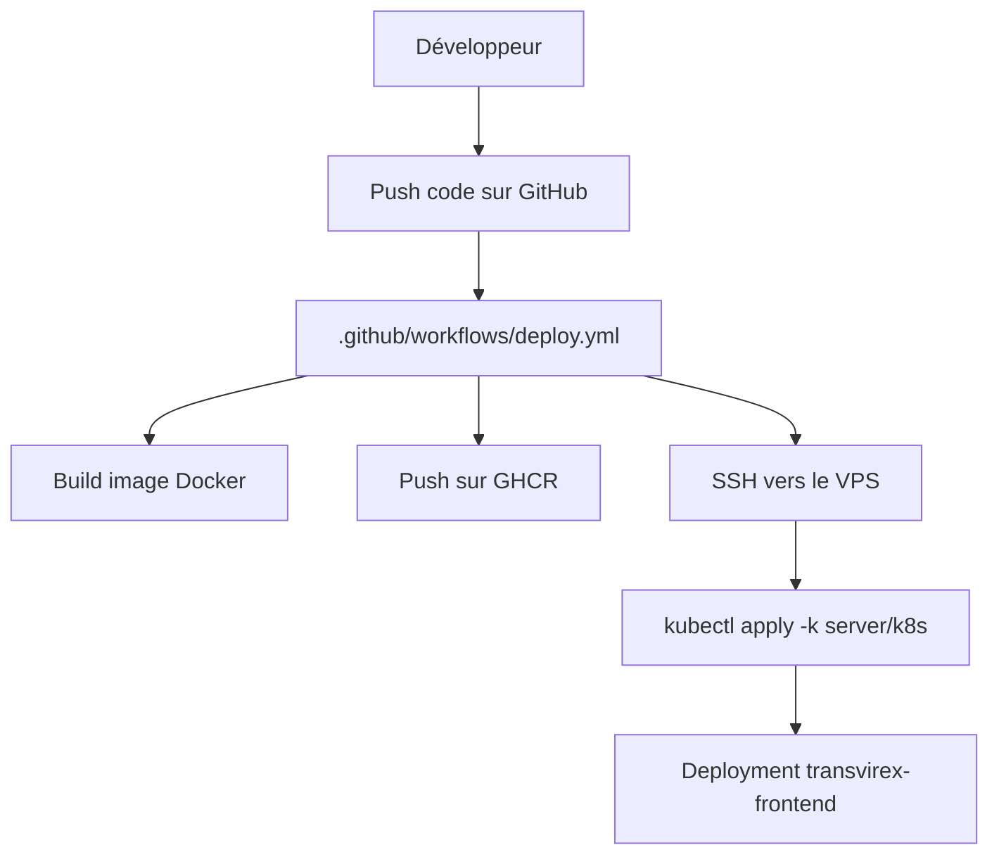
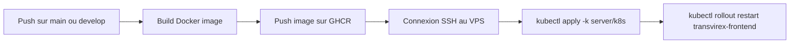

# ⚙️ Comprendre GitHub Actions en 15 minutes

## 🎯 En une phrase

GitHub Actions est le moteur CI/CD du projet: il construit l'image du frontend, la publie sur GHCR et déclenche le déploiement Kubernetes sur le VPS.

---

## 📍 Où situer GitHub Actions dans l'architecture

---

## 🏗️ Les concepts clés de GitHub Actions

### 🔁 Workflow

Un workflow est un fichier YAML dans `.github/workflows/` qui décrit le pipeline automatisé.

Dans ce projet, le workflow actif est [.github/workflows/deploy.yml](../.github/workflows/deploy.yml).

### ⚙️ Jobs et steps

Le workflow est organisé en jobs:

- `build` pour construire et publier l'image Docker
- `deploy` pour appliquer les manifests sur le VPS
- `notify` pour signaler le résultat

Chaque job contient des steps réutilisant des actions standards comme `actions/checkout`, `docker/login-action`, `docker/build-push-action`, `appleboy/ssh-action` et `appleboy/scp-action`.

### 🔐 Secrets

GitHub Actions utilise les secrets du dépôt pour protéger l'accès au VPS:

- `VPS_HOST`
- `VPS_SSH_KEY`
- `GITHUB_TOKEN` pour GHCR

### 📦 Registry

L'image publiée est stockée dans GitHub Container Registry sous `ghcr.io/<owner>/transvirex-frontend`.

---

## 🚀 Flux du workflow

---

## 📝 Ce qu'il faut retenir

1. Le workflow est déclenché par les pushes et les pull requests.
2. La source Docker est `src/frontend`.
3. Le déploiement se fait via SSH puis `kubectl`.
4. Aucun serveur supplémentaire n'est nécessaire.

---

## 📚 Références rapides

- [.github/workflows/deploy.yml](../.github/workflows/deploy.yml)
- [04-GITHUB-SECRETS.md](./04-GITHUB-SECRETS.md)
- [05-CONFIGURATION-REFERENCE.md](./05-CONFIGURATION-REFERENCE.md)
