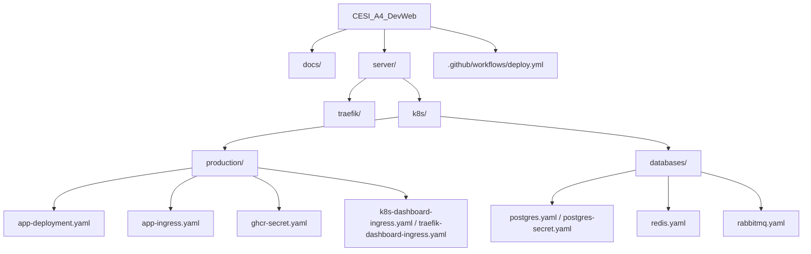
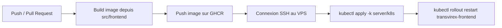

# 📁 Configuration Files Reference

## 🎯 Vue d'ensemble

Ce document récapitule les fichiers réellement présents dans `server/` et leur rôle dans le déploiement de Transvirex.

---

## 📋 Table des matières

1. [Structure globale](#structure-globale)
2. [Configuration Traefik](#configuration-traefik)
3. [Workflow GitHub Actions](#workflow-github-actions)
4. [Configuration Kubernetes](#configuration-kubernetes)
5. [Applications et bases de données](#applications-et-bases-de-données)

---

## 📁 Structure globale



---

## 🚦 Configuration Traefik

### Fichier: [server/traefik/values.yaml](../server/traefik/values.yaml)

Traefik est exposé en `LoadBalancer`, défini comme `IngressClass` par défaut et configuré avec quatre points d'entrée: `web`, `websecure`, `traefik` et `k8s-dashboard`.

```yaml
service:
    type: LoadBalancer

ingressClass:
    enabled: true
    isDefaultClass: true

global:
    checkNewVersion: false
    sendAnonymousUsage: false

ports:
    web:
        port: 80
    websecure:
        port: 443
    traefik:
        port: 9000
    k8s-dashboard:
        port: 8443

api:
    dashboard: true
    debug: false
    insecure: true

resources:
    limits:
        cpu: 500m
        memory: 512Mi
    requests:
        cpu: 100m
        memory: 128Mi
```

### Fichier: [server/traefik/README.md](../server/traefik/README.md)

Ce guide décrit l'installation Helm de Traefik et les commandes de vérification du service et du dashboard.

---

## 🚀 Workflow GitHub Actions

Le pipeline CI/CD est défini dans [.github/workflows/deploy.yml](../.github/workflows/deploy.yml). C'est la source de vérité pour le build Docker, la publication GHCR et le déploiement sur le VPS.



### Déclenchement

```yaml
on:
    push:
        branches:
            - main
            - develop
    pull_request:
        branches:
            - main
            - develop
```

### Image Docker

```yaml
env:
    REGISTRY: ghcr.io
    IMAGE_NAME: ${{ github.repository_owner }}/transvirex-frontend
```

### Build

```yaml
with:
    context: ./src/frontend
    file: ./src/frontend/Dockerfile
```

Le workflow publie l'image sur GitHub Container Registry avec le `GITHUB_TOKEN` du workflow.

### Déploiement

Sur `main`, le workflow:

1. Crée le namespace `production` sur le VPS si nécessaire.
2. Transfère `server/k8s/` sur le VPS.
3. Applique les manifests avec `kubectl apply -k /tmp/k8s-manifests/server/k8s`.
4. Force un redémarrage du deployment `transvirex-frontend`.
5. Attend la fin du rollout.

### Secrets utilisés

- `VPS_HOST`
- `VPS_SSH_KEY`

Le token de registry est fourni par `GITHUB_TOKEN`, donc aucun secret GHCR supplémentaire n'est requis.

---

## 🎮 Configuration Kubernetes

### Fichier: [server/k8s/namespace.yaml](../server/k8s/namespace.yaml)

Le dépôt définit explicitement deux namespaces pour les manifests K8s locaux: `production` et `databases`.

```yaml
---
apiVersion: v1
kind: Namespace
metadata:
    name: production
    labels:
        environment: production
        managed-by: kubernetes

---
apiVersion: v1
kind: Namespace
metadata:
    name: databases
    labels:
        environment: data
        managed-by: kubernetes
```

### Fichier: [server/k8s/kustomization.yaml](../server/k8s/kustomization.yaml)

```yaml
apiVersion: kustomize.config.k8s.io/v1beta1
kind: Kustomization

resources:
    - namespace.yaml
    - production/
    - databases/
```

### Fichier: [server/k8s/production/kustomization.yaml](../server/k8s/production/kustomization.yaml)

L'overlay de production agrège le déploiement du frontend, les ingress Traefik et les secrets de registry/certificats.

### Fichier: [server/k8s/databases/kustomization.yaml](../server/k8s/databases/kustomization.yaml)

L'overlay `databases` regroupe PostgreSQL, Redis et RabbitMQ pour la couche de persistance.

---

## 🧱 Applications et bases de données

### Frontend

- [server/k8s/production/app-deployment.yaml](../server/k8s/production/app-deployment.yaml)
- [server/k8s/production/app-ingress.yaml](../server/k8s/production/app-ingress.yaml)
- [server/k8s/production/ghcr-secret.yaml](../server/k8s/production/ghcr-secret.yaml)
- [server/k8s/production/k8s-dashboard-ingress.yaml](../server/k8s/production/k8s-dashboard-ingress.yaml)
- [server/k8s/production/traefik-dashboard-ingress.yaml](../server/k8s/production/traefik-dashboard-ingress.yaml)

Le frontend est déployé sous le nom `transvirex-frontend`, exposé via Traefik sur `transvirex.com` et `www.transvirex.com`, puis mis à jour automatiquement par GitHub Actions.

### Bases de données

- [server/k8s/databases/postgres.yaml](../server/k8s/databases/postgres.yaml)
- [server/k8s/databases/postgres-secret.yaml](../server/k8s/databases/postgres-secret.yaml)
- [server/k8s/databases/redis.yaml](../server/k8s/databases/redis.yaml)
- [server/k8s/databases/rabbitmq.yaml](../server/k8s/databases/rabbitmq.yaml)

Ces manifests fournissent PostgreSQL, Redis et RabbitMQ avec un stockage persistant pour la couche de données.
