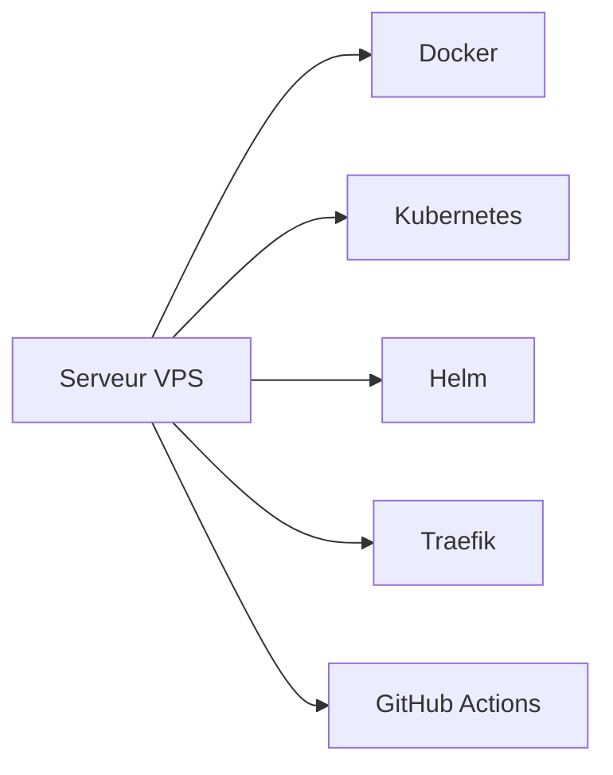

# 📋 Phase 1: Étapes manuelles pour le VPS

## 🚨 Important

Ce document couvre la préparation manuelle du VPS avant l'activation des déploiements automatisés.

Le déploiement applicatif actif est géré par [.github/workflows/deploy.yml](../.github/workflows/deploy.yml).

---

## 🎯 Vue d'ensemble

Ce guide décrit la mise en place initiale du VPS pour accueillir Kubernetes, Traefik et les manifests du projet.



---

## 📋 Table des matières

1. [Prérequis système](#prérequis-système)
2. [Installation Docker](#installation-docker)
3. [Installation Kubernetes](#installation-kubernetes)
4. [Installation Helm](#installation-helm)
5. [Configuration initiale Kubernetes](#configuration-initiale-kubernetes)
6. [Préparation des secrets](#préparation-des-secrets)
7. [Déploiement Traefik](#déploiement-traefik)
8. [Déploiement GitHub Actions](#déploiement-github-actions)
9. [Vérification](#vérification)
10. [Dépannage](#dépannage)

---

## 🖥️ Prérequis système

### Configuration VPS recommandée

| Ressource  | Minimum       | Recommandé       |
| ---------- | ------------- | ---------------- |
| **CPU**    | 2 cores       | 4 cores          |
| **RAM**    | 4 GB          | 8 GB             |
| **Disque** | 20 GB         | 50 GB            |
| **OS**     | Ubuntu 20.04+ | Ubuntu 22.04 LTS |

### Accès initial

```bash
ssh user@your-vps-ip
sudo su -
apt update && apt upgrade -y
```

---

## 🐳 Installation Docker

### 1. Ajouter le repository Docker

```bash
apt install -y apt-transport-https ca-certificates curl gnupg lsb-release
curl -fsSL https://download.docker.com/linux/ubuntu/gpg | gpg --dearmor -o /usr/share/keyrings/docker-archive-keyring.gpg
echo "deb [arch=amd64 signed-by=/usr/share/keyrings/docker-archive-keyring.gpg] https://download.docker.com/linux/ubuntu $(lsb_release -cs) stable" | tee /etc/apt/sources.list.d/docker.list > /dev/null
```

### 2. Installer Docker

```bash
apt update
apt install -y docker-ce docker-ce-cli containerd.io docker-compose-plugin
systemctl enable --now docker
docker --version
docker run hello-world
```

---

## ☸️ Installation Kubernetes

### 1. Installer kubelet, kubeadm, kubectl

```bash
curl -fsSLo /usr/share/keyrings/kubernetes-archive-keyring.gpg https://dl.k8s.io/apt/doc/apt-key.gpg
echo "deb [signed-by=/usr/share/keyrings/kubernetes-archive-keyring.gpg] https://apt.kubernetes.io/ kubernetes-xenial main" | tee /etc/apt/sources.list.d/kubernetes.list
apt update
apt install -y kubelet kubeadm kubectl
apt-mark hold kubelet kubeadm kubectl
```

### 2. Désactiver le swap

```bash
swapoff -a
sed -i '/ swap / s/^/#/' /etc/fstab
```

### 3. Charger les modules kernel requis

```bash
cat > /etc/modules-load.d/k8s.conf << EOF
overlay
br_netfilter
EOF

modprobe overlay
modprobe br_netfilter

cat > /etc/sysctl.d/k8s.conf << EOF
net.bridge.bridge-nf-call-iptables = 1
net.bridge.bridge-nf-call-ip6tables = 1
net.ipv4.ip_forward = 1
EOF

sysctl --system
```

### 4. Initialiser le cluster

```bash
kubeadm init --pod-network-cidr=10.244.0.0/16
```

### 5. Configurer kubectl

```bash
mkdir -p $HOME/.kube
sudo cp -i /etc/kubernetes/admin.conf $HOME/.kube/config
sudo chown $(id -u):$(id -g) $HOME/.kube/config
kubectl cluster-info
kubectl get nodes
```

### 6. Installer le plugin réseau

```bash
kubectl apply -f https://raw.githubusercontent.com/coreos/flannel/master/Documentation/kube-flannel.yml
kubectl get pods -n kube-system
```

---

## 📦 Installation Helm

### 1. Installer Helm

```bash
curl https://raw.githubusercontent.com/helm/helm/main/scripts/get-helm-3 | bash
helm version
```

### 2. Ajouter les repositories Helm

```bash
helm repo add traefik https://helm.traefik.io
helm repo update
helm repo list
```

---

## 🔧 Configuration initiale Kubernetes

### 1. Créer les namespaces

```bash
kubectl create namespace production
kubectl create namespace databases
kubectl get namespaces
```

### 2. Préparer l'accès GitHub Actions

Le workflow a besoin des secrets `VPS_HOST` et `VPS_SSH_KEY` côté dépôt GitHub.

Vérifie aussi que l'utilisateur `github-actions` peut se connecter au VPS en SSH.

```bash
ssh -i ~/.ssh/id_ed25519 github-actions@your-vps-ip
```

---

## 🔐 Préparation des secrets

### 1. Certificats SSL

Place les certificats de `transvirex.com` sur le VPS, puis crée le secret TLS dans `production`.

```bash
kubectl create secret tls certs \
  --cert=/etc/ssl/certs/transvirex.com.crt \
  --key=/etc/ssl/private/transvirex.com.key \
  -n production
```

### 2. Secret GHCR

Le deployment frontend tire l'image depuis GHCR. Si le cluster a besoin d'un accès privé, crée `ghcr-secret` dans `production`.

```bash
kubectl create secret docker-registry ghcr-secret \
  --docker-server=ghcr.io \
  --docker-username=YOUR_GITHUB_USERNAME \
  --docker-password=YOUR_TOKEN \
  --docker-email=your@email.com \
  -n production
```

---

## 🚦 Déploiement Traefik

### 1. Déployer Traefik

```bash
helm install traefik traefik/traefik \
  --namespace production \
  --create-namespace \
  -f server/traefik/values.yaml
```

### 2. Vérifier l'installation

```bash
kubectl get pods -n production
kubectl get svc -n production
kubectl logs -n production -l app.kubernetes.io/name=traefik
```

---

## 🤖 Déploiement GitHub Actions

### 1. Vérifier le workflow

```bash
cat .github/workflows/deploy.yml
```

### 2. Configurer les secrets du dépôt

Ajoute dans GitHub:

- `VPS_HOST`
- `VPS_SSH_KEY`

`GITHUB_TOKEN` est fourni automatiquement par GitHub Actions.

### 3. Déclencher un déploiement

```bash
git add .
git commit -m "deploy: trigger GitHub Actions"
git push origin main
```

### 4. Suivre l'exécution

1. Ouvre l'onglet **Actions** du dépôt.
2. Vérifie que le workflow `🚀 Build & Deploy` s'exécute.
3. Contrôle le rollout du deployment `transvirex-frontend` sur le VPS.

---

## ✅ Vérification

```bash
kubectl get namespaces
kubectl get pods -A
kubectl get svc -A
kubectl get deployments -A
```

---

## 🆘 Dépannage

### Pod en erreur

```bash
kubectl describe pod pod-name -n namespace
kubectl logs pod-name -n namespace
```

### Échec du déploiement

```bash
kubectl get events -n production
kubectl logs -n production -l app=transvirex-frontend
```

### Problème SSH

- Vérifier `VPS_HOST`.
- Vérifier `VPS_SSH_KEY`.
- Tester la connexion SSH avec l'utilisateur `github-actions`.

---

## 🎯 Prochaines étapes

1. Appliquer les manifests de `server/k8s/production/` et `server/k8s/databases/`.
2. Ajouter les secrets du dépôt GitHub.
3. Lancer un premier push sur `main`.

---

## 📚 Ressources

- [03-CONCEPTS-GITHUB-ACTIONS.md](./03-CONCEPTS-GITHUB-ACTIONS.md)
- [05-CONFIGURATION-REFERENCE.md](./05-CONFIGURATION-REFERENCE.md)
- [server/traefik/README.md](../server/traefik/README.md)
