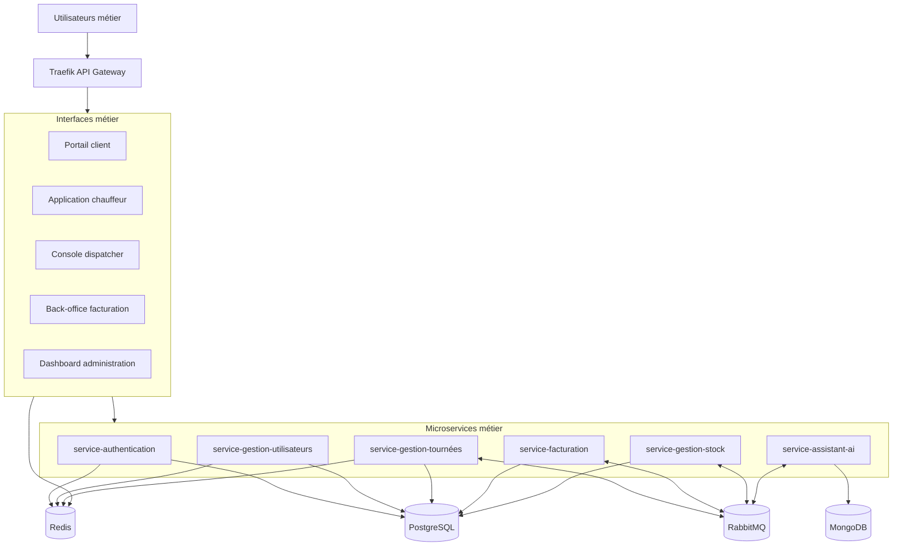

# 🏛️ Architecture de l'application

## 🎯 Objectif

Ce document décrit l'architecture cible de l'ERP Transvirex Logistics à partir des notes de conception fournies. L'objectif est de clarifier les couches techniques, les interfaces métier et le rôle exact de chaque microservice.

La version retenue ici suit une architecture orientée microservices fonctionnels: chaque service couvre un domaine métier précis, avec un frontend adapté aux rôles utilisateurs, un bus d'événements pour l'asynchrone et des bases de données spécialisées selon les besoins.

---

## 🧭 Vue d'ensemble

---

## 🧱 Couches applicatives

### 1. Couche présentation

Les interfaces utilisateurs sont séparées par rôle pour garder un parcours simple et un niveau d'accès cohérent:

- Portail client pour la consultation des livraisons et des demandes.
- Application chauffeur pour la tournée, les statuts et les incidents.
- Console dispatcher pour l'affectation et le suivi temps réel.
- Back-office facturation pour les factures, exports et relances.
- Dashboard administration pour les paramètres, la supervision et les droits.

### 2. Couche d'accès

Traefik joue le rôle de point d'entrée unique:

- Routage HTTP/HTTPS vers les bons frontends.
- Exposition des dashboards et services publics.
- Gestion des certificats et des hôtes métier.

### 3. Couche métier

Les microservices sont découplés par domaine fonctionnel:

- Chaque service est responsable de ses règles métiers.
- Les échanges synchrones sont réservés aux besoins immédiats.
- Les échanges asynchrones passent par RabbitMQ pour éviter le couplage fort.

### 4. Couche données

- PostgreSQL stocke les données métier structurées.
- Redis gère les sessions, le cache et les données temporaires.
- MongoDB conserve les conversations, journaux et traces de l'assistant IA.

---

## 📚 Catalogue complet des microservices

## 1. `service-authentication`

### Rôle

Sécuriser l'accès à la plateforme et émettre les identifiants d'authentification.

### Actions à réaliser

- Créer les comptes techniques et métiers.
- Authentifier les utilisateurs.
- Émettre les tokens d'accès et de renouvellement.
- Vérifier les rôles et permissions.
- Révoquer les sessions invalidées.
- Gérer les changements de mot de passe et les expirations.

### Données manipulées

- Identité utilisateur.
- Rôles, groupes, permissions.
- Sessions et tokens.

---

## 2. `service-gestion-utilisateurs`

### Rôle

Centraliser le référentiel des utilisateurs et de leurs droits fonctionnels.

### Actions à réaliser

- Créer, modifier, consulter et désactiver les utilisateurs.
- Gérer les profils chauffeur, dispatcher, client, facturation et administrateur.
- Associer un utilisateur à un dépôt, une zone ou une équipe.
- Mettre à jour les informations de contact et d'organisation.
- Synchroniser les informations utiles avec le service d'authentification.
- Fournir les données de profil aux frontends.

### Données manipulées

- Fiches utilisateurs.
- Profils métier.
- Affectations organisationnelles.

---

## 3. `service-gestion-tournées`

### Rôle

Orchestrer les tournées, les affectations et le suivi opérationnel des livraisons.

### Actions à réaliser

- Créer une tournée à partir des commandes ou des contraintes opérationnelles.
- Affecter une tournée à un chauffeur.
- Ajouter, retirer ou réordonner les étapes de livraison.
- Publier les statuts de tournée et les événements de progression.
- Recevoir les confirmations de prise en charge, livraison ou échec.
- Gérer les incidents, retards et replanifications.
- Diffuser les événements utiles aux autres services via RabbitMQ.

### Données manipulées

- Tournées.
- Étapes de tournée.
- Statuts opérationnels.
- Incidents et exceptions.

---

## 4. `service-facturation`

### Rôle

Calculer, produire et suivre la facturation des livraisons et des prestations.

### Actions à réaliser

- Identifier les livraisons facturables.
- Calculer les montants, taxes et totaux.
- Générer les factures et exports.
- Suivre l'état des paiements.
- Déclencher les relances et notifications de retard.
- Fournir les indicateurs financiers au back-office.
- Recevoir les événements métier des autres services pour alimenter la comptabilité.

### Données manipulées

- Factures.
- Paiements.
- Avoirs et relances.
- Indicateurs de facturation.

---

## 5. `service-gestion-stock`

### Rôle

Gérer le stock logistique et les mouvements de marchandises entre les dépôts, les tournées et les destinations.

### Actions à réaliser

- Enregistrer les entrées et sorties de stock.
- Réserver des colis ou lots pour une tournée.
- Décrémenter le stock lors de la préparation ou de l'expédition.
- Mettre à jour la localisation d'un colis.
- Déclarer les écarts, pertes ou dommages.
- Synchroniser les mouvements avec les événements de livraison.
- Fournir une vision de stock exploitable par les équipes métier.

### Données manipulées

- Référentiel de stock.
- Mouvements logistiques.
- État et localisation des colis.

---

## 6. `service-assistant-ai`

### Rôle

Aider les équipes métier par des fonctions d'assistance intelligente et d'analyse contextuelle.

### Actions à réaliser

- Répondre aux questions opérationnelles des utilisateurs.
- Résumer l'état d'une tournée, d'un incident ou d'une journée.
- Proposer des actions ou priorités à partir des données métier.
- Transcrire des notes vocales si le projet retient une fonction speech-to-text.
- Conserver l'historique des conversations et des recommandations.
- Analyser les signaux faibles dans les logs ou les échanges métier.
- Produire des suggestions pour la planification ou la résolution d'incidents.

### Données manipulées

- Conversations IA.
- Historique des requêtes.
- Résumés et recommandations.
- Traces d'analyse.

---

## 🔌 Communication entre services

### Synchrone

Utilisé pour les besoins immédiats:

- Authentification.
- Consultation de profils.
- Affichage d'un état de tournée.
- Lecture des données de facturation.

### Asynchrone

Utilisé pour découpler les traitements et absorber les pics de charge:

- Mise à jour d'un statut de livraison.
- Création d'une facture après livraison.
- Réservation ou libération de stock.
- Publication d'un incident.
- Transmission d'un résumé à l'assistant IA.

### Bus d'événements

RabbitMQ sert à:

- Diffuser les événements métier.
- Permettre des traitements différés.
- Réduire le couplage entre les services.

---

## 🗃️ Rôle des bases de données

### PostgreSQL

Base principale pour les données métiers structurées:

- Utilisateurs.
- Tournées.
- Livraison.
- Facturation.
- Stock.

### Redis

Stockage temporaire et haute fréquence:

- Sessions.
- Cache.
- Données temps réel.
- Positions ou états courants des chauffeurs.

### MongoDB

Stockage documentaire et historique intelligent:

- Conversations de l'assistant IA.
- Traces de suggestion.
- Journaux enrichis.
- Résumés et annotations.

---

## 🎯 Résumé métier

Cette architecture sépare clairement:

- Les interfaces par rôle.
- Les responsabilités métier par domaine.
- Les échanges temps réel et les traitements asynchrones.
- Les données structurées, temporaires et documentaires.

Elle permet d'évoluer service par service sans bloquer les autres domaines de l'ERP.
