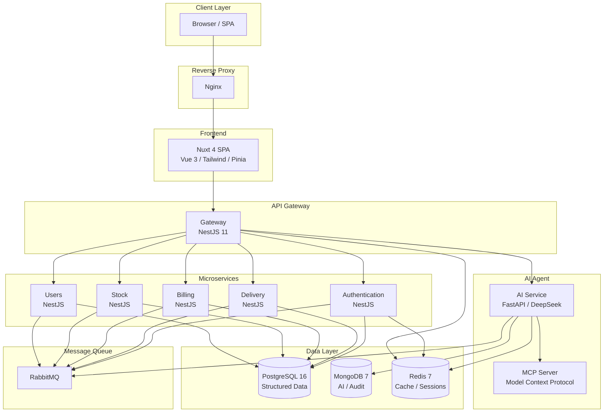
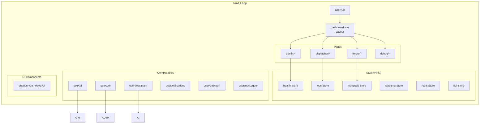
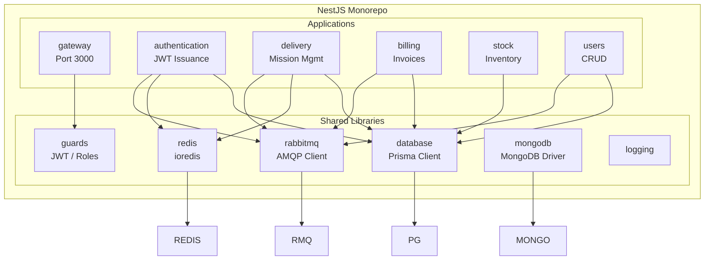
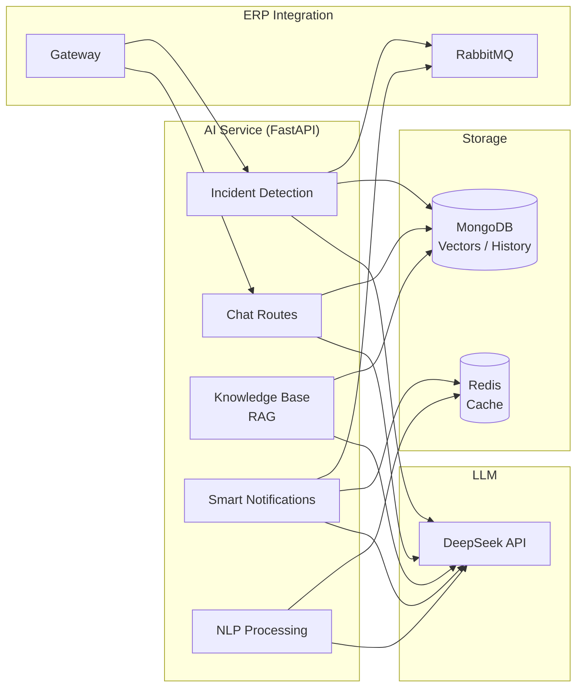
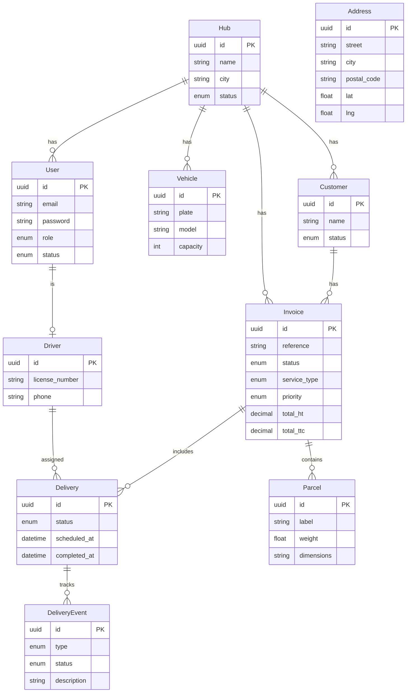
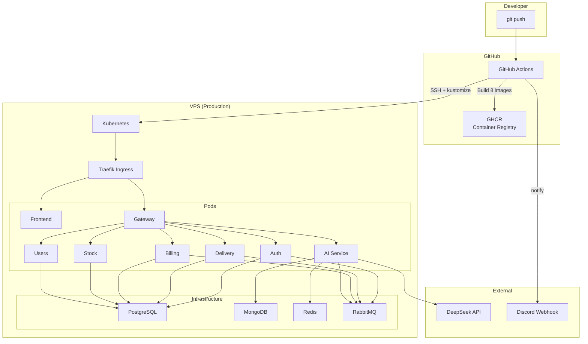

# Architecture — Transvirex ERP

## 1. High-Level Architecture

The system follows a **microservices architecture** with an API Gateway pattern. Each backend service is independently deployable, communicates via RabbitMQ for async messages, and shares data through dedicated databases.

## 2. Frontend Architecture

The frontend is a **Nuxt 4** single-page application with server-side rendering support.

### Frontend Key Decisions

- **Nuxt 4** with SSR for SEO and initial load performance
- **Pinia 3** for state management with modular stores
- **Tailwind CSS 4 + shadcn-vue** for consistent, accessible UI
- **Chart.js + vue-chartjs** for dashboard visualizations
- **jsPDF** for invoice PDF generation
- **@lucide/vue** icons throughout
- **Reka UI** headless components for complex interactions
- Auto-imported composables via Nuxt's composables directory

### Pages by Role

| Role | Pages |
|------|-------|
| Admin | Dashboard, Users, Hubs, Drivers, Vehicles, Customers, Parcels, Deliveries, Invoices, Reports, Settings |
| Dispatcher | Dashboard, Deliveries, Drivers, Customers, Parcels, Invoices |
| Driver | Dashboard, Deliveries, AI Assistant, Profile |
| Debug | Health, Logs, PostgreSQL, MongoDB, Redis, RabbitMQ |

## 3. Backend Architecture (NestJS Monorepo)

### Microservices Responsibility

| Service | Responsibility | Dependencies |
|---------|---------------|-------------|
| **Gateway** | API facade, request routing, auth delegation, DTO validation | PostgreSQL, Redis, RabbitMQ |
| **Authentication** | JWT issue/refresh, login, role extraction | PostgreSQL, Redis, RabbitMQ |
| **Delivery** | Mission CRUD, status lifecycle, driver assignment | PostgreSQL, RabbitMQ, Redis |
| **Billing** | Invoice generation, payment tracking, export | PostgreSQL, RabbitMQ |
| **Users** | User CRUD, hub assignment, roles | PostgreSQL, RabbitMQ |
| **Stock** | Inventory management | PostgreSQL |

### Communication Patterns

- **Synchronous**: REST over HTTP (Gateway → Services via internal routes)
- **Asynchronous**: RabbitMQ for event-driven updates (status changes, notifications)
- **Caching**: Redis for session tokens, rate limiting, temporary data
- **Database-per-service**: Each service connects to PostgreSQL independently

## 4. AI Agent Architecture

### AI Features

| Feature | Description |
|---------|-------------|
| **Chat** | Conversational interface for drivers and dispatchers |
| **Incident Detection** | Monitors delivery data for anomalies and triggers alerts |
| **RAG Knowledge Base** | Retrieval-Augmented Generation using MongoDB vector store |
| **Smart Notifications** | Context-aware alerts sent via RabbitMQ to the frontend |
| **NLP Processing** | Parses unstructured messages (WhatsApp/phone transcripts) |
| **MCP Protocol** | Model Context Protocol server for standardized AI tool access |

### Tech Choices

- **FastAPI** for async Python performance with automatic OpenAPI docs
- **DeepSeek LLM** for cost-effective, high-quality language model inference
- **Motor** (async MongoDB driver) for non-blocking database access
- **MCP** for standardized model-to-tool integration

## 5. Database Schema (Prisma)

### Data Storage Strategy

| Database | Purpose | Technology |
|----------|---------|------------|
| PostgreSQL | Structured business data (users, deliveries, invoices) | Prisma ORM |
| MongoDB | AI agent data (vectors, chat history, knowledge base) | Motor (async) |
| Redis | Session cache, rate limiting, real-time flags | ioredis |

## 6. Deployment Architecture

### CI/CD Pipeline

1. **Push** to `main` or `develop` triggers GitHub Actions
2. **8 parallel builds** — each service is independently Dockerized and pushed to GHCR
3. **Smoke tests** — AI service container is started and `/health` is checked
4. **Deploy** (main only) — SSH into VPS, apply Kustomize manifests, rolling restart
5. **Notify** — Discord webhook on success/failure

### Infrastructure Requirements

| Resource | Spec |
|----------|------|
| VPS | 4 vCPU, 8 GB RAM, 50 GB SSD (minimum) |
| Kubernetes | Single-node (minikube/k3s) or multi-node cluster |
| Domain | Configured with TLS certificates |
| Secrets | JWT_SECRET, DEEPSEEK_API_KEY, GHCR_PAT |

## 7. Security Architecture

- **JWT authentication** with access + refresh token pair
- **Role-based access control** enforced at Gateway level
- **HTTPS everywhere** via Traefik with automatic TLS
- **Encrypted secrets** stored as Kubernetes Secrets (not in ConfigMaps)
- **Rate limiting** via @nestjs/throttler (configurable per endpoint)
- **Production guards** to block dangerous operations in production

## 8. Technology Decisions

| Decision | Rationale |
|----------|-----------|
| NestJS monorepo | Shared libraries (database, guards, Redis) reduce duplication |
| Nuxt 4 + SSR | SEO for public pages, fast initial render |
| Prisma 7 + PostgreSQL | Type-safe ORM with migrations for structured data |
| MongoDB for AI | Document model fits chat history and vector embeddings |
| RabbitMQ | Reliable async messaging between services |
| FastAPI for AI | Python ecosystem for ML/LLM, async by default |
| DeepSeek LLM | Cost-effective alternative to GPT-4 for logistics use cases |
| Kustomize | Native Kubernetes config without Helm complexity |
| Traefik | Automatic TLS, Kubernetes CRD support, middleware chain |
